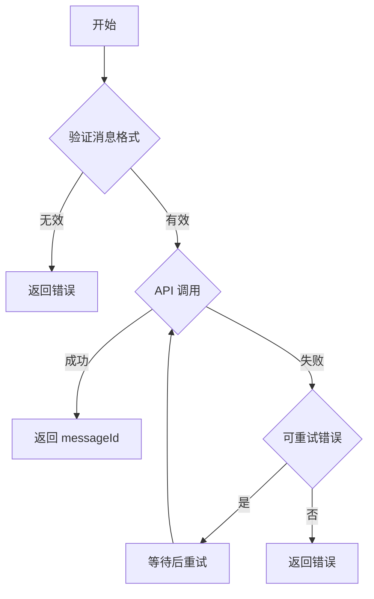

# OpenClaw WebHub Channel - 消息流程

> **上一节**：[05-configuration.md](05-configuration.md)  
> **下一节**：[07-error-handling.md](07-error-handling.md)

---

## 1. 发送消息流程

### 流程说明

1. **Agent 请求发送消息**
   - OpenClaw Agent 调用 `sendMessage(target, content)`
   
2. **消息验证**
   - 验证消息格式是否正确
   - 检查必填字段
   
3. **构建请求**
   - 将 OpenClaw 消息格式转换为 Website API 格式
   - 应用字段映射规则
   
4. **发送请求**
   - 发起 HTTP POST 请求到 `/api/webhub/messages`
   
5. **处理响应**
   - 解析 Website 返回的响应
   - 返回 messageId 给 Agent

---

## 2. 接收消息流程

### 流程说明

1. **Website 触发事件**
   - 用户发送消息或执行操作
   
2. **Webhook 推送**
   - Website 发送 POST 请求到 `/webhub/webhook`
   - 包含签名验证头
   
3. **签名验证**
   - 验证请求签名是否有效
   - 验证时间戳防止重放攻击
   
4. **消息解析**
   - 解析 JSON 请求体
   - 验证必填字段
   
5. **格式转换**
   - 将 Website 消息格式转换为 OpenClaw 格式
   - 应用字段映射规则
   
6. **路由到 Agent**
   - 查找对应的 Agent Session
   - 发送消息通知

---

## 3. 消息转换流程

### 转换规则

| 源字段 | 目标字段 | 说明 |
|--------|----------|------|
| `message.id` | `inbound.id` | 消息 ID 映射 |
| `message.timestamp` | `inbound.timestamp` | 时间戳转换 |
| `sender.userId` | `inbound.authorId` | 发送者映射 |
| `content.text` | `inbound.content` | 内容提取 |
| `media[]` | `inbound.media[]` | 媒体转换 |

---

## 4. 错误处理流程

---

*最后更新: 2026-02-06*
